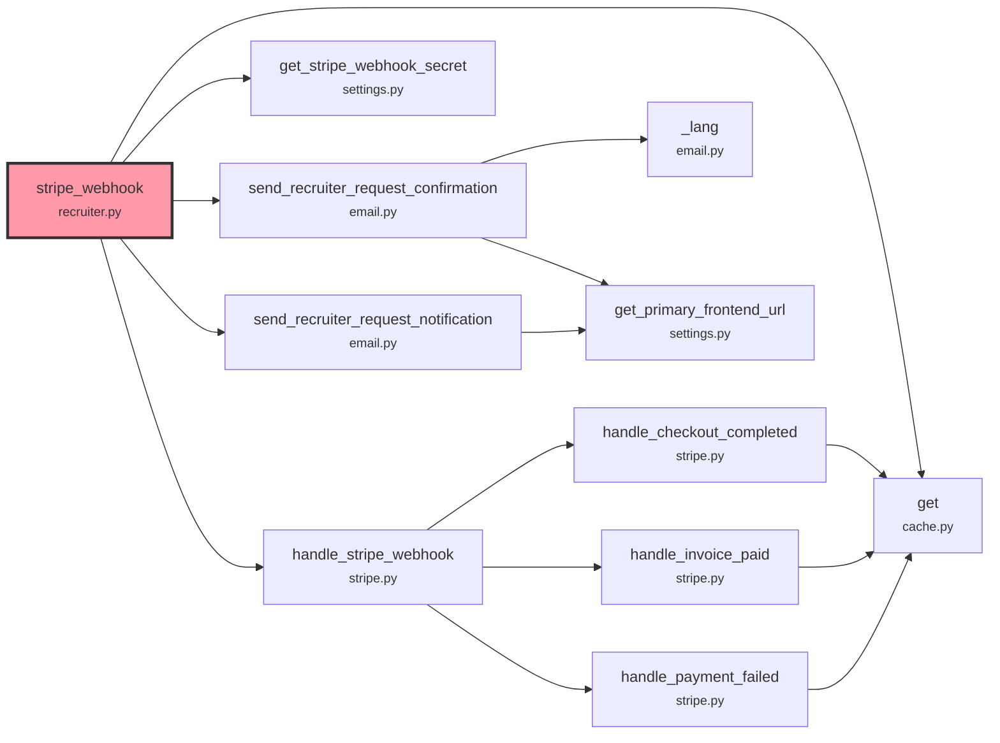

# Call Graph — huntzen_jobsearch

Centre sur : `stripe_webhook`

```mermaid
graph LR
  get["get<br/><small>cache.py</small>"]
  get_primary_frontend_url["get_primary_frontend_url<br/><small>settings.py</small>"]
  get_stripe_webhook_secret["get_stripe_webhook_secret<br/><small>settings.py</small>"]
  handle_stripe_webhook["handle_stripe_webhook<br/><small>stripe.py</small>"]
  handle_invoice_paid["handle_invoice_paid<br/><small>stripe.py</small>"]
  send_recruiter_request_confirmation["send_recruiter_request_confirmation<br/><small>email.py</small>"]
  handle_checkout_completed["handle_checkout_completed<br/><small>stripe.py</small>"]
  handle_payment_failed["handle_payment_failed<br/><small>stripe.py</small>"]
  stripe_webhook["stripe_webhook<br/><small>recruiter.py</small>"]:::focus
  _lang["_lang<br/><small>email.py</small>"]
  send_recruiter_request_notification["send_recruiter_request_notification<br/><small>email.py</small>"]
  handle_stripe_webhook --> handle_checkout_completed
  handle_stripe_webhook --> handle_invoice_paid
  handle_stripe_webhook --> handle_payment_failed
  handle_invoice_paid --> get
  send_recruiter_request_confirmation --> _lang
  send_recruiter_request_confirmation --> get_primary_frontend_url
  handle_checkout_completed --> get
  handle_payment_failed --> get
  stripe_webhook --> get
  stripe_webhook --> get_stripe_webhook_secret
  stripe_webhook --> send_recruiter_request_confirmation
  stripe_webhook --> send_recruiter_request_notification
  stripe_webhook --> handle_stripe_webhook
  send_recruiter_request_notification --> get_primary_frontend_url
  classDef focus fill:#f9a,stroke:#333,stroke-width:3px
```

Genere par LocalCoder.
Visualisable dans : VS Code (extension Mermaid), GitHub, tout editeur Markdown moderne.
